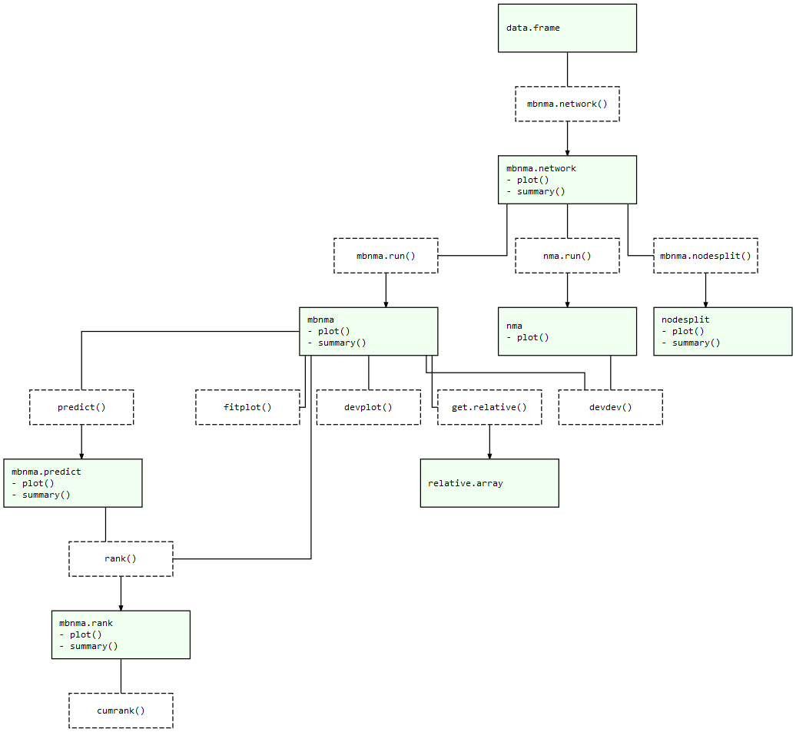

<!-- README.md is generated from README.Rmd. Please edit that file -->

```{r setup, include = FALSE}
knitr::opts_chunk$set(
  collapse = TRUE,
  comment = "#>",
  fig.path = "README-",
  out.width = "100%"
)
```
# MBNMAdose

The goal of `MBNMAdose` is to provide a collection of useful commands that allow users to run dose-response Model-Based Network Meta-Analyses (MBNMA). This allows evidence synthesis of studies that compare multiple doses
of different agents in a way that can account for the dose-response relationship.

Whilst making use of all the available evidence in a statistically robust and biologically plausible framework, this also can help connect networks at the agent level that may otherwise be disconnected at the dose/treatment level, and help improve precision of estimates. It avoids "lumping" of doses that is often done in standard Network Meta-Analysis (NMA). All models and analyses are implemented in a Bayesian framework, following an extension of the standard NMA methodology presented by [@lu2004] and are run in JAGS [-@jags]. For full details of dose-response MBNMA methodology see Mawdsley et al. [-@mawdsley2016]. Throughout this package we refer to a **treatment** as a specific **dose** or a specific **agent**.


## Installation

Currently the package can be installed directly from GitHub using the `devtools` R package:

``` r
# First install devtools
install.packages("devtools")

# Then install MBNMAdose directly from GitHub
devtools::install_github("hugopedder/MBNMAdose")
```

Once it is released on CRAN (i.e. **not yet!**), you will (hopefully) be able to install the released version of `MBNMAdose` from [CRAN](https://CRAN.R-project.org) with:

``` r
install.packages("MBNMAdose")
```

## Workflow

Functions within `MBNMAdose` follow a clear pattern of use:

1. Load your data into the correct format using `mbnma.network()`
2. Analyse your data using `mbnma.run()`, or any of the available wrapper dose-response functions
3. Test for consistency at the treatment-level using functions like `nma.nodesplit()` and `nma.run()`
4. Examine model results using forest plots and treatment rankings
5. Use your model to predict responses using `predict()`

At each of these stages there are a number of informative plots that can be generated to help understand the data and to make decisions regarding model fitting. Exported functions in the package are connected as follows:



## References
